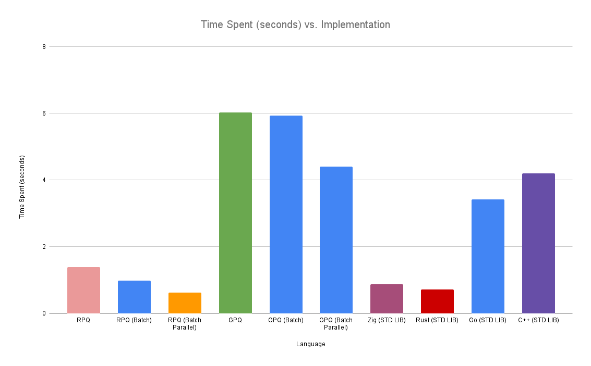

# PQ-Bench

## Background
This repository contains benchmarks for various priority queue implementations in Go, Rust, Zig, and C++. All tests are single threaded and designed to try and reproduce roughly the same workload across all implementations. While these benchmarks are not perfect, they should give a rough idea of the performance of each implementation and how they might work in a real-world scenario. 

### Sister Repositories
- [fibheap (Fibonacci Heaps)](https://github.com/JustinTimperio/fibheap)
- [gpq (Go Priority Queue)](https://github.com/JustinTimperio/gpq)
- [rpq (Rust Priority Queue)](https://github.com/JustinTimperio/rpq)

## Benchmarks

Language       | Time Spent (seconds)
---------------|---------------------
Go (GPQ)       | 3.48
Rust (RPQ)     | 1.82
Zig (STD LIB)  | 0.87
Rust (STD LIB) | 0.72
Go (STD LIB)   | 3.41
C++ (STD LIB)  | 4.24

## Features
| Feature          | GPQ | RPQ | Go Heap | Zig Priority Queue | C++ Queue | Rust Binary Heap |
|------------------|-----|-----|---------|--------------------|-----------|------------------|
| Enqueue          | ✅   | ✅   | ✅       | ✅                  | ✅         | ✅                |
| Dequeue          | ✅   | ✅   | ✅       | ✅                  | ✅         | ✅                |
| Disk Cache       | ✅   | ✅   | ❌       | ❌                  | ❌         | ❌                |
| Mutable Priority | ✅   | ✅   | ✅       | ❌                  | ❌         | ❌                |
| Timeouts         | ✅   | ✅   | ❌       | ❌                  | ❌         | ❌                |
